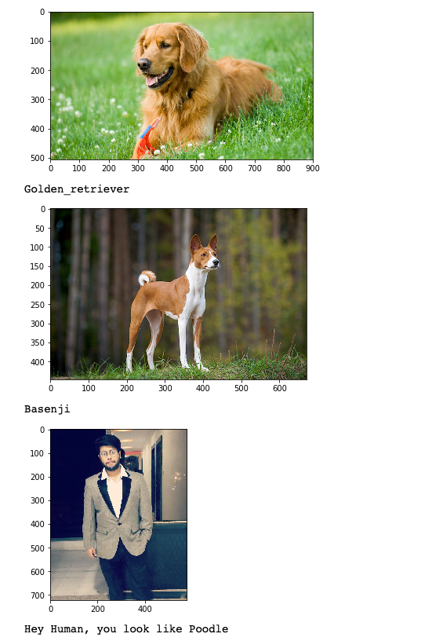

# Dog_transfer_learning

This project is an application of transfer learning. 

#### What is transfer learning?
This is a technique of pruning some top layers of a deep neural network model trained by some giant company and enly given access to the same. Following diagram shows a brief of transfer learning.

My results - 

Image fed to the network is given and under that the predited class is written

